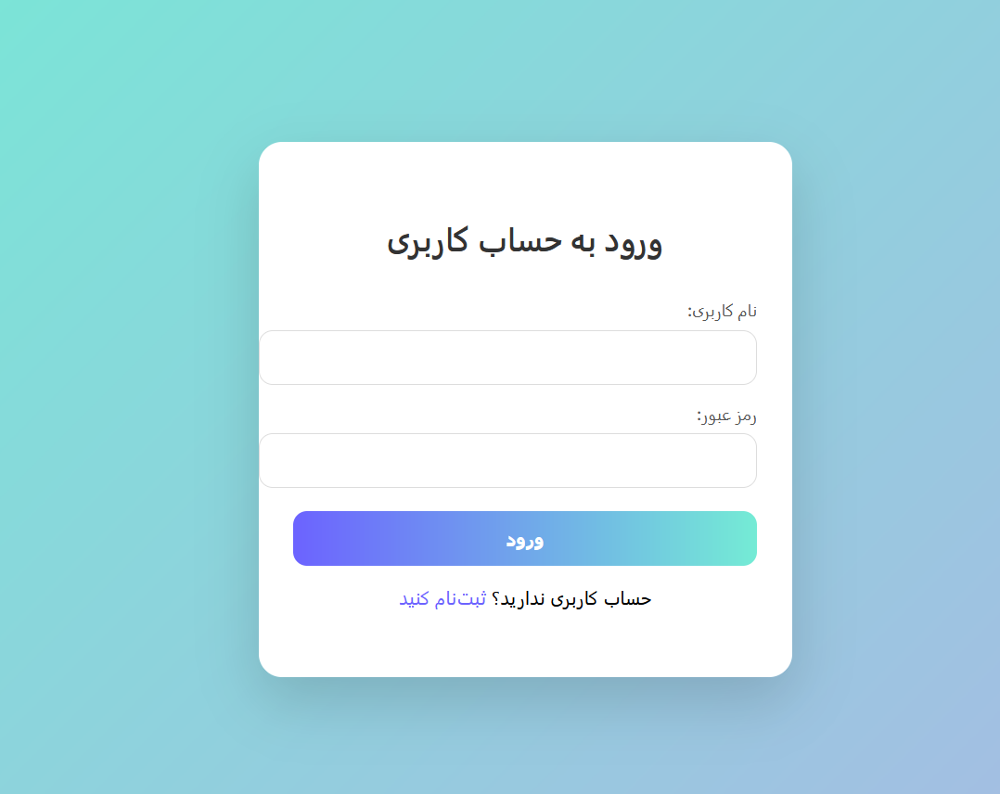
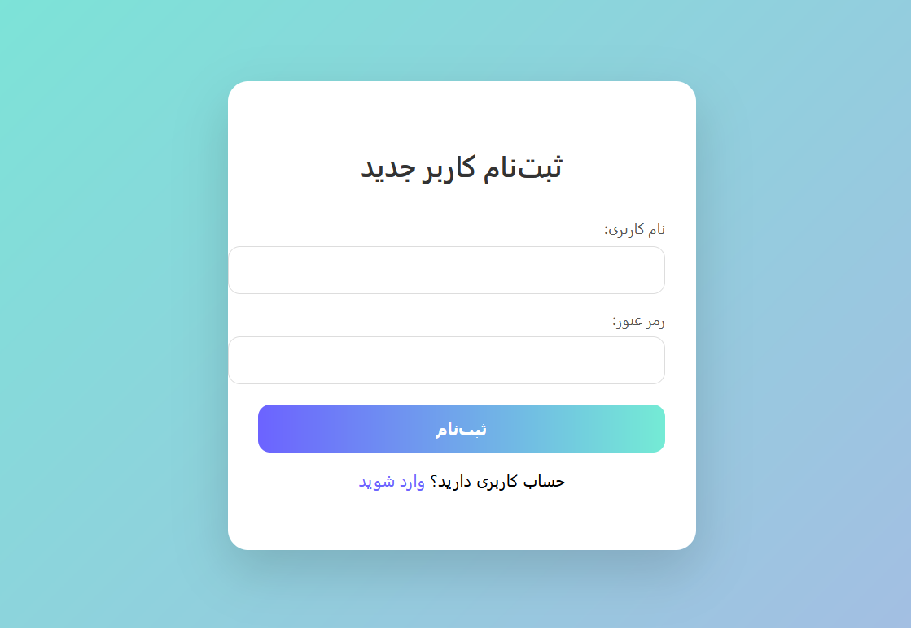
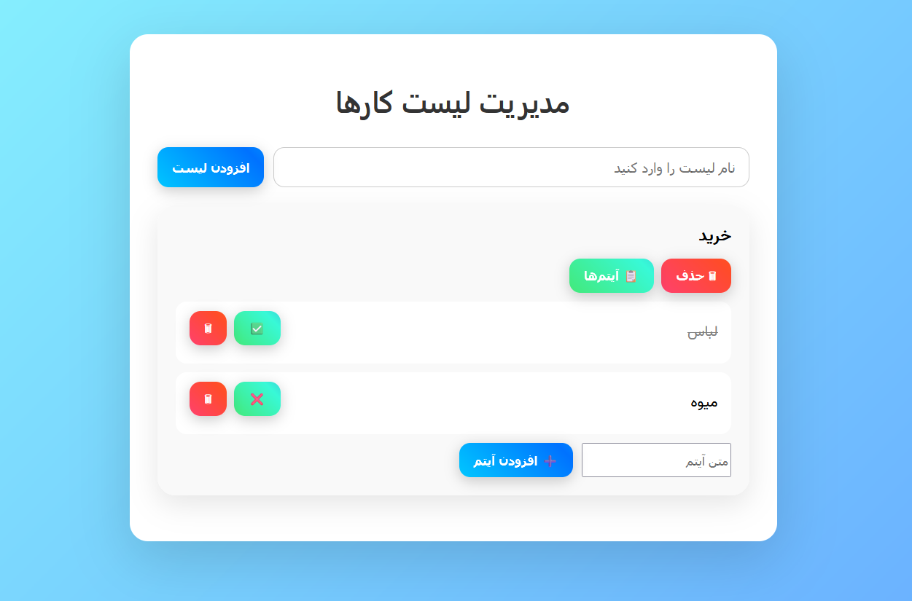

# ToDoList Application

A Full-Stack ToDo List application using Spring Boot (Backend) and Frontend.

---

## Features
- User registration & login
- Create, update, delete to-do lists
- Add/remove items in lists
- Mark items as done/undone
- Responsive UI

---

## Screenshots

### Login Page


### Register Page


### Dashboard


---

## Backend
- Java 17, Spring Boot 3.5
- MySQL, JPA/Hibernate
- Spring Security
- MapStruct for DTO mapping


### Run Backend
```bash
cd backend
mvn spring-boot:run
